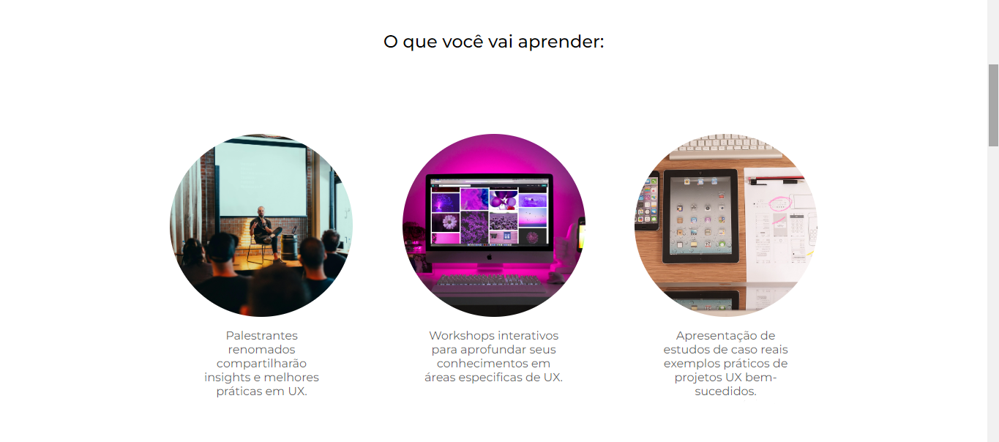
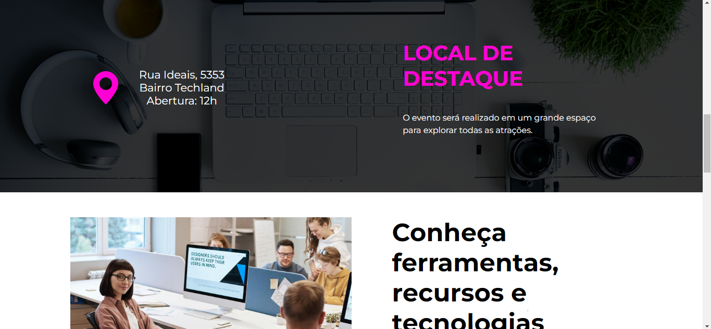

# UXperience Summit

## Descrição
UXperience é um projeto fictício que realizei para demonstrar minhas habilidades como desenvolvedora, focando em um evento de User Experience (UX).

## Recursos
- Apresentação de sessões HTML
- Estilização usando CSS
- Design responsivo para dispositivos móveis

## Tecnologias Utilizadas
- HTML
- CSS

## Capturas de Tela

*Header do projeto com formulário de contato*

*Detalhes do evento*

*Local do evento*

- Acesse o link para ver o projeto completo: https://jessicasamppaio.github.io/UXperienceSummit/

## Autor
Jéssica Sampaio - (https://www.jessicasamppaio.github.io)

